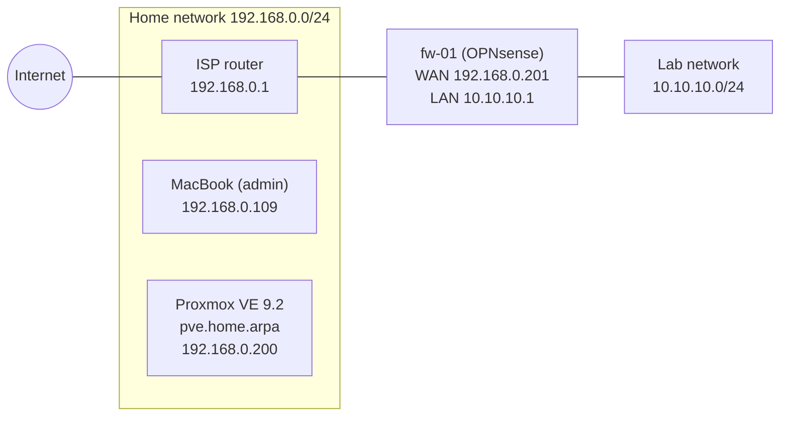

# homelab

An on-demand Proxmox lab on my old desktop PC, built to practice networking and Linux
administration for NOC and sysadmin roles. The lab is isolated from my home network,
so nothing I break can take down the household internet. Every phase ends with a
writeup of what I did, what went wrong, and how I fixed it.

## Highlights

From [writeup 02 — An isolated lab network behind an OPNsense VM](writeups/02-opnsense-isolated-lab.md):

- Built an isolated lab network on a Proxmox bridge with no physical port, with an
  OPNsense VM as the only way in or out: DHCP, recursive DNS, NAT, and a logged rule
  that blocks the lab from every device at home.
- Traced repeated lockouts from the firewall's web interface to an alias that a
  diagnostics button had emptied, using the firewall log, the address tables the
  firewall had actually loaded, and the configuration history. It also showed that my
  first explanation was wrong.
- Tested the design with a throwaway container: the lab reaches the internet, can't
  reach the house, and the house keeps working with the firewall off.

From [writeup 01 — Proxmox VE on a dual-boot PC](writeups/01-proxmox-dual-boot.md):

- Found that Windows was booting from an EFI System Partition on the disk I was about to
  wipe, and moved it to the Windows SSD with `diskpart` and `bcdboot` before installing.
- Diagnosed why Proxmox could reach the router but not resolve names: the ISP router
  doesn't answer DNS queries.
- Fixed Windows Recovery Environment, which broke after the boot partition move.

## Current setup



| | |
| --- | --- |
| Host | Intel i7-7700K, 16 GB RAM |
| Lab storage | 240 GB SSD, dual-boot with Windows on a separate SSD |
| Hypervisor | Proxmox VE 9.2 on ext4 + LVM-thin |
| Firewall | OPNsense 26.7.5 VM (`fw-01`), the only path between the lab and the house |

Full details in [docs/hardware.md](docs/hardware.md) and [docs/network.md](docs/network.md).
Why it's built this way: [docs/decisions.md](docs/decisions.md).

## Progress

- [x] Phase 1 — Proxmox VE dual-boot install ([writeup](writeups/01-proxmox-dual-boot.md))
- [x] Phase 2 — OPNsense and an isolated lab network ([writeup](writeups/02-opnsense-isolated-lab.md))
- [ ] Phase 3 — Linux servers (Ubuntu, Rocky), SSH, VM backup and restore
- [ ] Phase 4 — VLANs and MikroTik CHR site-to-site WireGuard
- [ ] Phase 5 — Break-and-fix incidents

## Repository layout

```text
docs/       hardware inventory, network map and design decisions
writeups/   one writeup per phase, with screenshots in writeups/img/
```
