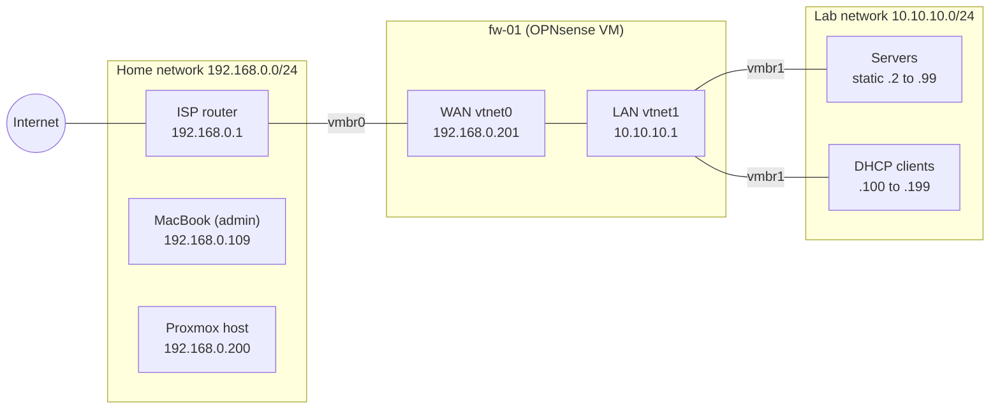

# Network

The lab has its own network, `10.10.10.0/24`, behind an OPNsense VM (`fw-01`). The home network doesn't change and doesn't depend on the lab: with `fw-01` off, the house still has internet. How it was built and tested: [writeup 02](../writeups/02-opnsense-isolated-lab.md).



## Home network: `192.168.0.0/24`

| Address | Device |
| --- | --- |
| `192.168.0.1` | ISP router (Technicolor CGA4233), gateway |
| `192.168.0.2`–`.199` | The router's DHCP range |
| `192.168.0.109` | MacBook (admin machine), reserved on the router |
| `192.168.0.200` | Proxmox host (`pve.home.arpa`) |
| `192.168.0.201` | `fw-01` WAN |

Static addresses go from `.200` up, outside the router's DHCP range.

## Lab network: `10.10.10.0/24`

| Address | Use |
| --- | --- |
| `10.10.10.1` | `fw-01` LAN: gateway, DNS and DHCP for the lab |
| `10.10.10.2`–`.99` | Static IPs. Planned: `web-01` (`.10`), `files-01` (`.11`), MikroTik CHR (`.21`, `.22`) |
| `10.10.10.100`–`.199` | DHCP |
| `10.10.10.200`–`.254` | Free |

Domain: `lab.home.arpa`.

## Proxmox bridges

| Bridge | Physical port | Host IP | What connects to it |
| --- | --- | --- | --- |
| `vmbr0` | `nic0` | `192.168.0.200/24` | The home network, and `fw-01`'s WAN (`net0`) |
| `vmbr1` | None | None | The lab: `fw-01`'s LAN (`net1`) and every lab machine. VLAN aware, for phase 4 |

Lab machines connect only to `vmbr1`. Anything on `vmbr0` is on the home network and doesn't go through the firewall.

## `fw-01`

| | |
| --- | --- |
| Product | OPNsense 26.7.5 |
| VM | ID 100, 2 vCPUs, 2 GB RAM, 20 GB disk, starts at boot (order 1) |
| WAN | `vtnet0` (Proxmox `net0`), `192.168.0.201/24`, gateway `192.168.0.1` |
| LAN | `vtnet1` (Proxmox `net1`), `10.10.10.1/24` |
| Web interface | `https://10.10.10.1`, from the Mac with `labup` |

| Service | Configuration |
| --- | --- |
| DNS | Unbound on port 53, recursive (no forwarders). DNSSEC off for now. Queries for `lab.home.arpa` go to Dnsmasq |
| DHCP | Dnsmasq on the LAN, `10.10.10.100`–`.199`. Registers DHCP hostnames in `lab.home.arpa` |
| NAT | Outbound, automatic mode: lab traffic leaves with `192.168.0.201` |
| Reply-to | Off (see [decisions](decisions.md#reply-to-off)) |

## Aliases

| Name | Type | Content |
| --- | --- | --- |
| `HOME_NET` | Network(s) | `192.168.0.0/24` |
| `ADMIN_MAC` | Host(s) | `192.168.0.109` |

## Firewall rules

Rules are checked by Sequence, lowest first, and the first match wins.

**WAN**

| Sequence | Action | Version | Source | Destination | Log | Description |
| --- | --- | --- | --- | --- | --- | --- |
| 111 | Pass | IPv4 | `ADMIN_MAC` | LAN net | No | `Allow admin Mac to lab` (Disable reply-to checked) |
| — | Block | | Anything else | | | OPNsense's default block on the WAN |

**LAN**

| Sequence | Action | Version | Source | Destination | Log | Description |
| --- | --- | --- | --- | --- | --- | --- |
| 10 | Block | IPv4 | LAN net | `HOME_NET` | Yes | `Block lab to home network` |
| 20 | Pass | IPv4 | LAN net | any | No | `Default allow LAN to any rule` |
| 21 | Pass | IPv6 | LAN net | any | No | `Default allow LAN IPv6 to any rule` |

## What can talk to what

| Traffic | Result |
| --- | --- |
| Mac → lab | Allowed (WAN rule, only from `192.168.0.109`) |
| Lab → internet | Allowed (default LAN rule and NAT) |
| Lab → home network | Blocked and logged |
| Other home devices → lab | Blocked (no WAN rule matches) |

Replies always get back: the firewall is stateful, so the answers to a connection the Mac opened aren't checked against the LAN block.

## Reaching the lab from the Mac

The home router doesn't know about `10.10.10.0/24`, so the Mac needs a route through `fw-01`. Two aliases in `~/.zshrc`:

```bash
alias labup='sudo route -n add -net 10.10.10.0/24 192.168.0.201'
alias labdown='sudo route -n delete -net 10.10.10.0/24'
```

Check with `route -n get 10.10.10.1`: it must say `gateway: 192.168.0.201`.
