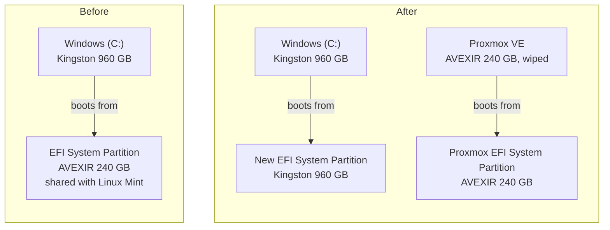
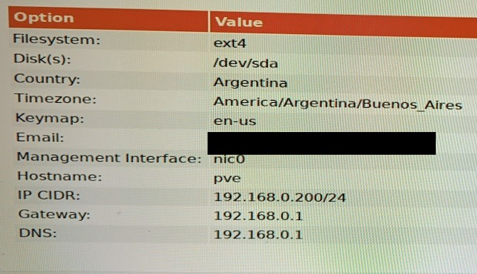
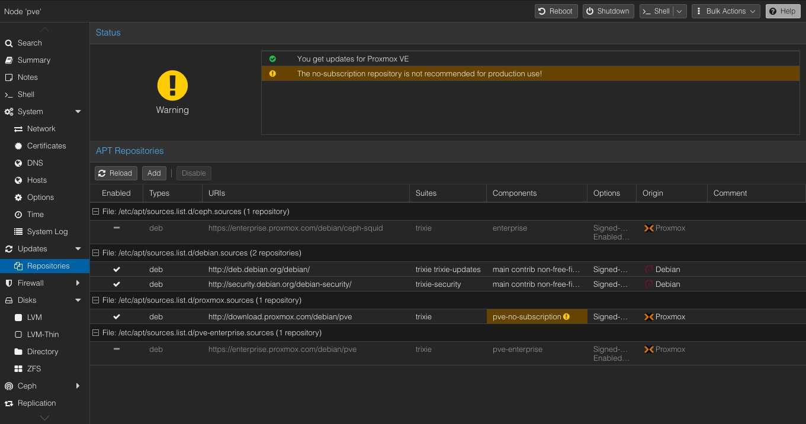
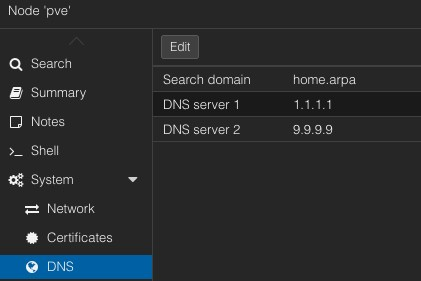

# Proxmox VE on a dual-boot PC without breaking Windows

**Date:** 2026-09-27 · **Phase:** 1 · **Time spent:** ~4 h

## TL;DR

- I installed Proxmox VE 9.2 on the 240 GB SSD of my old PC and kept Windows on its own 960 GB SSD. I pick the system from the BIOS boot menu.
- Windows' boot partition was on the SSD I was going to wipe. Before installing, I created a new one on the Windows SSD with `diskpart` and `bcdboot`, and checked that Windows booted with the other SSD unplugged.
- After the install, the server could reach the router but couldn't resolve names: my ISP router doesn't answer DNS queries. I switched Proxmox to public DNS servers (`1.1.1.1` and `9.9.9.9`).
- After the move, the Windows Recovery Environment couldn't be enabled: its settings still pointed to the old boot configuration. Resetting `ReAgent.xml` fixed it.

## Goal

Install Proxmox VE on my old PC and keep Windows working (dual boot). Each system lives on its own disk, so if one breaks, the other still boots.

## Environment

| Component | Detail |
| --- | --- |
| Motherboard | MSI Z270 Gaming M3 (UEFI) |
| CPU | Intel Core i7-7700K (VT-x enabled in the BIOS, VT-d off) |
| RAM | 16 GB |
| GPU | NVIDIA GTX 1060 6 GB |
| Windows disk | Kingston SA400 960 GB SSD (Windows 10) |
| Proxmox disk | AVEXIR S100 240 GB SSD (it had Linux Mint before) |
| Other disks | 3 HDDs with personal data, not touched |
| Proxmox | VE 9.2 ISO; after updating, `pve-manager/9.2.20` with kernel `7.0.14-19-pve` |
| Network | ISP router (Technicolor CGA4233) at `192.168.0.1`; Proxmox at `192.168.0.200/24` (`pve.home.arpa`) |
| Admin machine | MacBook on the same home network |

More details in [`docs/hardware.md`](../docs/hardware.md).

## Background: how a UEFI PC finds its operating system

If you already know what an EFI System Partition is, skip this section.

A UEFI PC doesn't really boot "a disk". It boots a **file**:

1. The motherboard firmware keeps a list of boot entries (the ones you see in the BIOS boot menu). Each entry points to a bootloader file on a specific partition.
2. That partition is the **EFI System Partition (ESP)**: a small FAT32 partition with one folder per system, for example `\EFI\Microsoft\` for Windows and `\EFI\ubuntu\` for Linux Mint's bootloader (GRUB).
3. The bootloader then loads the operating system from its own partition.

The catch: **the ESP doesn't have to be on the same disk as the operating system.** Windows can be installed on disk A and boot from an ESP on disk B. If you wipe disk B, Windows stops booting, even though you never touched disk A. That was my situation:



Before: wiping the AVEXIR would have deleted the partition Windows boots from. After: each system boots from its own disk.

## What I did

### 1. Preparation

- **Backups.** I checked my backups before touching any disk.
- **Room for static IPs.** My router's DHCP handed out every address from `.2` to `.254`, so there was no safe address for a static IP. I reduced the DHCP range to `.2`–`.199`, which leaves `.200`–`.254` for devices with static IPs. If a static IP sits inside the DHCP range, the router can give the same address to another device, and then both devices fight for it (an IP conflict).

  Then I checked from the Mac that no device was using the two addresses I planned: `.200` for Proxmox and `.201` for OPNsense in phase 2.

  ```text
  $ ping -c 3 192.168.0.200
  PING 192.168.0.200 (192.168.0.200): 56 data bytes
  Request timeout for icmp_seq 0
  Request timeout for icmp_seq 1

  --- 192.168.0.200 ping statistics ---
  3 packets transmitted, 0 packets received, 100.0% packet loss

  $ ping -c 3 192.168.0.201
  PING 192.168.0.201 (192.168.0.201): 56 data bytes
  Request timeout for icmp_seq 0
  ping: sendto: No route to host
  Request timeout for icmp_seq 1

  --- 192.168.0.201 ping statistics ---
  3 packets transmitted, 0 packets received, 100.0% packet loss
  ```

  No reply isn't 100% proof, because some devices ignore ping. Together with the new DHCP range, it's enough for a home network.

- **Virtualization in the BIOS.** VT-x, the hardware virtualization Proxmox needs to run VMs, was already enabled: I had turned it on years ago. I confirmed it later from Proxmox, because `/dev/kvm` only exists when KVM can use VT-x:

  ```text
  root@pve:~# ls -l /dev/kvm
  crw-rw---- 1 root kvm 10, 232 Sep 28 01:35 /dev/kvm
  root@pve:~# dmesg | grep -i -E "DMAR|IOMMU" | head -5
  [    3.274762] iommu: Default domain type: Translated
  [    3.274762] iommu: DMA domain TLB invalidation policy: lazy mode
  ```

  VT-d, on the other hand, is off. With VT-d on, the kernel log would show lines about the DMAR table, and there are none; those two `iommu` lines appear either way. VT-d is only needed to pass hardware directly to a VM (PCI passthrough), which isn't in my plan, so I left it off.
- **Windows Fast Startup already off.** I had disabled it years ago. With Fast Startup, "Shut down" actually hibernates Windows, which causes trouble with dual boot and with disks being unplugged.
- **Checks.** Windows boots in UEFI mode (`$env:firmware_type` returns `UEFI`), and BitLocker is off, so changing the boot files wouldn't trigger a BitLocker recovery key prompt.

### 2. Moving Windows' boot partition to the Windows SSD

**Finding the problem.** This command shows which disk holds the partition that Windows booted from:

```powershell
PS> Get-Partition | Where-Object IsSystem | Get-Disk | Select-Object Number, FriendlyName, @{n='SizeGB'; e={[math]::Round($_.Size / 1GB)}}

Number FriendlyName               SizeGB
------ ------------               ------
     2 AVEXIR S100 SERIES - 240GB 224.00
```

But Windows itself (`C:`) is on the Kingston:

```powershell
PS> Get-Partition -DriveLetter C | Get-Disk | Select-Object Number, FriendlyName, PartitionStyle, @{n='SizeGB'; e={[math]::Round($_.Size / 1GB)}}

Number FriendlyName          PartitionStyle SizeGB
------ ------------          -------------- ------
     0 KINGSTON SA400S37960G GPT            894.00
```

(The 960 GB disk shows as 894 because Windows counts in binary units: 960,000,000,000 bytes ÷ 1024³ ≈ 894.)

This is what was inside that ESP. `mountvol S: /S` mounts the ESP as drive `S:`, and `mountvol S: /D` removes the letter again:

```powershell
PS> mountvol S: /S
PS> Get-ChildItem S:\EFI

    Directory: S:\EFI

Mode                 LastWriteTime         Length Name
----                 -------------         ------ ----
d----          2019-11-06 12:02 AM                Boot
da---          2023-11-26  1:47 PM                Lenovo
d----          2017-05-23  3:06 AM                Microsoft
d----          2026-03-07 12:12 AM                ubuntu

PS> mountvol S: /D
```

`Microsoft` is the Windows Boot Manager, there since 2017, and `ubuntu` is the GRUB bootloader that Linux Mint added in 2026. Both systems shared this partition, and it was on the disk I was about to wipe.

**The fix: a new ESP on the Windows SSD.** I made it 500 MB; Windows needs about 100 MB, so this leaves plenty of room. Everything runs in PowerShell as administrator. `diskpart` opens its own prompt:

```text
PS> diskpart

DISKPART> select volume C
Volume 0 is the selected volume.

DISKPART> shrink desired=500
DiskPart successfully shrunk the volume by:  500 MB

DISKPART> create partition efi size=500
DiskPart succeeded in creating the specified partition.

DISKPART> format quick fs=fat32 label=System
  100 percent completed
DiskPart successfully formatted the volume.

DISKPART> assign letter=S
DiskPart successfully assigned the drive letter or mount point.

DISKPART> exit
```

What each command does:

- `select volume C` selects the Windows volume and, with it, the disk it's on (the Kingston).
- `shrink desired=500` takes 500 MB from the end of `C:` and leaves that space unallocated.
- `create partition efi size=500` creates an ESP in that free space.
- `format quick fs=fat32 label=System` formats it as FAT32, the file system UEFI firmware can read.
- `assign letter=S` gives it a temporary drive letter so files can be copied to it.

> [!TIP]
> Before `create partition`, run `list disk`. The disk marked with an asterisk (`*`) is where the partition will be created, so check its size to confirm it's the right disk.

To confirm the new partition, I had to refresh PowerShell's view of the disks first (see [problem 3](#problem-3-powershell-couldnt-see-the-new-partition)):

```powershell
PS> Update-HostStorageCache
PS> Get-Partition -DiskNumber 0 | Select-Object PartitionNumber, DriveLetter, @{n='SizeMB'; e={[math]::Round($_.Size / 1MB)}}, Type

PartitionNumber DriveLetter    SizeMB Type
--------------- -----------    ------ ----
              1                16.00 Reserved
              2           C 915198.00 Basic
              3               500.00 System
```

Partition 3 (500 MB, type `System`) is the new ESP. Then I copied the Windows boot files to it and removed the temporary letter:

```powershell
PS> bcdboot C:\Windows /s S: /f UEFI
Boot files successfully created.
PS> mountvol S: /D
```

- `C:\Windows` is the Windows installation to take the boot files from.
- `/s S:` is the partition to copy them to.
- `/f UEFI` tells it the firmware type.

Because the new partition was empty, `bcdboot` also created a brand-new boot configuration store (BCD) there. That had a side effect on the Windows Recovery Environment: see [problem 4](#problem-4-the-windows-recovery-environment-couldnt-be-enabled).

**The test.** I shut down, unplugged the AVEXIR's SATA data cable and powered on. Windows booted normally, so it no longer depended on the other SSD. If it hadn't booted, plugging the AVEXIR back in would have brought back the old setup, because the old ESP was still there. That's why this test comes before wiping anything.

### 3. Installing Proxmox

I unplugged every disk except the AVEXIR. The installer lists every disk it finds, and with only one connected, there's no way to wipe the wrong one. Then I booted the USB from the BIOS boot menu, choosing the entry that starts with `UEFI:` (the other entry for the same USB boots in legacy mode).



| Setting | Value | Why |
| --- | --- | --- |
| Filesystem | `ext4` | ZFS uses a lot of RAM for its cache, and with 16 GB I want that RAM for VMs |
| Disk | `/dev/sda` (the AVEXIR, the only disk connected) | After reconnecting the other disks, it became `/dev/sdc`. Linux names disks in the order it finds them, so identify disks by size or model, not by name |
| Hostname | `pve` (full name `pve.home.arpa`) | `home.arpa` is reserved for home networks ([RFC 8375](https://www.rfc-editor.org/rfc/rfc8375)), so it can't clash with a real domain |
| IP / gateway | `192.168.0.200/24` / `192.168.0.1` | Outside the DHCP range |
| DNS | `192.168.0.1` | This turned out to be wrong: see [problem 2](#problem-2-router-reachable-but-names-didnt-resolve) |

After the install, I reconnected all the disks. The installer put Proxmox first in the boot order, so now Proxmox boots by default and I choose Windows from the boot menu. Both systems boot fine.

This is the final disk layout, seen from Proxmox:

```text
root@pve:~# lsblk -o NAME,SIZE,TYPE,FSTYPE,MOUNTPOINT
NAME                 SIZE TYPE FSTYPE      MOUNTPOINT
sda                894.3G disk
├─sda1                16M part
├─sda2             893.7G part ntfs
└─sda3               500M part vfat
sdb                  1.8T disk
├─sdb1                 1K part
└─sdb5               1.7T part ntfs
sdc                223.6G disk
├─sdc1              1007K part
├─sdc2                 1G part vfat        /boot/efi
└─sdc3               222G part LVM2_member
  ├─pve-swap           8G lvm  swap        [SWAP]
  ├─pve-root        65.5G lvm  ext4        /
  ├─pve-data_tmeta   1.3G lvm
  │ └─pve-data     129.8G lvm
  └─pve-data_tdata 129.8G lvm
    └─pve-data     129.8G lvm
sdd                  3.6T disk
├─sdd1               1.8T part ntfs
└─sdd2               1.8T part ntfs
sde                  1.8T disk
├─sde1                 1K part
└─sde5               1.8T part ntfs
```

- `sda` is the Kingston: `sda1` is a small partition Windows reserves, `sda2` is `C:`, and `sda3` is the new ESP.
- `sdc` is the AVEXIR, now all Proxmox: `sdc1` is a tiny partition for legacy BIOS boot, `sdc2` is Proxmox's own ESP, and `sdc3` is an LVM volume split into swap, the system (`/`) and `data`. `data` is a thin pool, shown as `local-lvm` in the web interface; the VM disks go there.
- `sdb`, `sdd` and `sde` are the HDDs, untouched.

### 4. First steps in Proxmox

**Web interface.** From the Mac I opened `https://192.168.0.200:8006`. The browser warns that the certificate isn't trusted. That's expected: Proxmox uses a self-signed certificate.

**Repositories.** Proxmox comes with the enterprise repositories enabled, and they need a paid subscription. Without one, updates fail with `401 Unauthorized`. In the node's Updates → Repositories, I disabled `pve-enterprise` and the Ceph enterprise repository, and added `pve-no-subscription`, which is free and fine for a lab. The yellow warning is expected.



**Updates.** Updates → Refresh, then Upgrade, which runs `apt dist-upgrade`. No errors, and the kernel went from `7.0.2-6-pve` to `7.0.14-19-pve`.

> [!IMPORTANT]
> On Proxmox, always update with `apt dist-upgrade` (or `apt full-upgrade`), never with plain `apt upgrade`. Plain `upgrade` doesn't handle packages whose dependencies changed, and it can leave Proxmox half updated.

**DNS.** Changed to public DNS servers; see [problem 2](#problem-2-router-reachable-but-names-didnt-resolve).

**SSH key.** From the Mac I copied my SSH key to the server:

```bash
ssh-copy-id root@192.168.0.200
```

I also added an alias to `~/.ssh/config`, so `ssh pve` is enough:

```text
Host pve
    HostName 192.168.0.200
    User root
```

**Clock.** A common dual-boot problem is the clock jumping by a few hours after switching systems. Windows stores local time in the motherboard clock (RTC), while Linux stores UTC. I had already fixed this when I installed Linux Mint, by telling Windows to treat the RTC as UTC. Proxmox confirms the RTC is in UTC:

```text
root@pve:~# timedatectl
               Local time: Sun 2026-09-27 21:59:02 -03
           Universal time: Mon 2026-09-28 00:59:02 UTC
                 RTC time: Mon 2026-09-28 00:59:03
                Time zone: America/Argentina/Buenos_Aires (-03, -0300)
System clock synchronized: yes
              NTP service: active
          RTC in local TZ: no
```

## What went wrong and how I fixed it

### Problem 1: no network after the install

**Symptom.** On the first boot, the server couldn't reach the router:

```text
root@pve:~# ip -br a
lo               UNKNOWN        127.0.0.1/8 ::1/128
nic0             DOWN
vmbr0            DOWN           192.168.0.200/24
root@pve:~# ping -c 3 192.168.0.1
PING 192.168.0.1 (192.168.0.1) 56(84) bytes of data.
From 192.168.0.200 icmp_seq=1 Destination Host Unreachable
From 192.168.0.200 icmp_seq=2 Destination Host Unreachable
From 192.168.0.200 icmp_seq=3 Destination Host Unreachable
```

**Hypothesis.** Both interfaces were `DOWN`, which means no physical link (layer 1). The ping error comes from the server itself (`From 192.168.0.200`): it tried to find `192.168.0.1` on the local network with an ARP request ("who has 192.168.0.1?") and got no answer.

Why two interfaces? Proxmox doesn't put the IP address on the network card. `nic0` is the physical card, and it's plugged into `vmbr0`, a virtual switch (a Linux bridge) that holds the server's IP and will later connect the VMs to the network. If the card has no link, the bridge goes down too.

**Cause.** The Ethernet cable from the PC to the router wasn't plugged in.

**Fix.** I plugged it in. Both interfaces came up and the router answered:

```text
root@pve:~# ip -br a
lo               UNKNOWN        127.0.0.1/8 ::1/128
nic0             UP
vmbr0            UP             192.168.0.200/24 fe80::<redacted>/64
root@pve:~# ping -c 3 192.168.0.1
PING 192.168.0.1 (192.168.0.1) 56(84) bytes of data.
64 bytes from 192.168.0.1: icmp_seq=1 ttl=64 time=1.56 ms
64 bytes from 192.168.0.1: icmp_seq=2 ttl=64 time=1.11 ms
64 bytes from 192.168.0.1: icmp_seq=3 ttl=64 time=1.07 ms

--- 192.168.0.1 ping statistics ---
3 packets transmitted, 3 received, 0% packet loss, time 2003ms
rtt min/avg/max/mdev = 1.073/1.247/1.561/0.222 ms
```

**Lesson.** Start at the bottom. If `ip -br a` says `DOWN`, check the cable before anything else.

### Problem 2: router reachable, but names didn't resolve

**Symptom.** The router answered, but the server couldn't resolve domain names:

```text
root@pve:~# ping -c 3 download.proxmox.com
ping: download.proxmox.com: Temporary failure in name resolution
```

**Checks, one layer at a time:**

```text
root@pve:~# cat /etc/resolv.conf
search home.arpa
nameserver 192.168.0.1
root@pve:~# ip route
default via 192.168.0.1 dev vmbr0 proto kernel onlink
192.168.0.0/24 dev vmbr0 proto kernel scope link src 192.168.0.200
root@pve:~# ping -c 3 1.1.1.1
PING 1.1.1.1 (1.1.1.1) 56(84) bytes of data.
64 bytes from 1.1.1.1: icmp_seq=1 ttl=56 time=16.4 ms
64 bytes from 1.1.1.1: icmp_seq=2 ttl=56 time=16.3 ms
64 bytes from 1.1.1.1: icmp_seq=3 ttl=56 time=17.1 ms

--- 1.1.1.1 ping statistics ---
3 packets transmitted, 3 received, 0% packet loss, time 2003ms
rtt min/avg/max/mdev = 16.297/16.609/17.147/0.382 ms
```

What this tells me:

- `ip route` has a `default via 192.168.0.1` line, so the server knows how to reach the internet.
- `ping 1.1.1.1` works, so the internet connection works. Pinging an IP address skips DNS completely.
- The only thing failing is name resolution. The server asks `192.168.0.1` (the router), the DNS server I typed in the installer.

**Hypothesis.** Some ISP routers don't answer DNS queries themselves. Instead, their DHCP gives devices the ISP's DNS servers directly.

**Check.** From the Mac, which gets its settings from the router's DHCP:

```text
$ dig @192.168.0.1 download.proxmox.com

; <<>> DiG 9.10.6 <<>> @192.168.0.1 download.proxmox.com
; (1 server found)
;; global options: +cmd
;; connection timed out; no servers could be reached

$ scutil --dns | grep nameserver
  nameserver[0] : 181.30.140.196
  nameserver[1] : 181.30.140.136
  nameserver[0] : 181.30.140.196
  nameserver[1] : 181.30.140.136
```

- `dig @192.168.0.1` sends a DNS query straight to the router. It timed out: the router doesn't answer DNS.
- `scutil --dns` shows the DNS servers the Mac uses: the ISP's, which the router hands out through DHCP.

**Cause.** The router isn't a DNS server. Devices that use DHCP never notice, because they get the ISP's DNS servers directly. Proxmox has a static configuration, and I had pointed it at the router.

**Fix.** In the node's System → DNS, I set `1.1.1.1` (Cloudflare) as DNS server 1 and `9.9.9.9` (Quad9) as DNS server 2. This edits `/etc/resolv.conf`.



```text
root@pve:~# cat /etc/resolv.conf
search home.arpa
nameserver 1.1.1.1
nameserver 9.9.9.9
root@pve:~# ping -c 3 download.proxmox.com
PING na2.cdn.proxmox.com (95.133.229.241) 56(84) bytes of data.
64 bytes from 95.133.229.241: icmp_seq=1 ttl=48 time=171 ms
64 bytes from 95.133.229.241: icmp_seq=2 ttl=48 time=173 ms
64 bytes from 95.133.229.241: icmp_seq=3 ttl=48 time=174 ms

--- na2.cdn.proxmox.com ping statistics ---
3 packets transmitted, 3 received, 0% packet loss, time 2002ms
rtt min/avg/max/mdev = 170.930/172.750/173.915/1.304 ms
```

Why public DNS servers and not the ISP's: Proxmox has a static configuration, so if the ISP changes its DNS servers, Proxmox won't find out (DHCP devices would). Public ones don't change, and using two different providers means one outage doesn't break name resolution. More in [`docs/decisions.md`](../docs/decisions.md).

### Problem 3: PowerShell couldn't see the new partition

**Symptom.** Right after `diskpart`, PowerShell said the new `S:` partition didn't exist:

```powershell
PS> Get-Partition -DriveLetter S | Select-Object DiskNumber, @{n='SizeMB'; e={[math]::Round($_.Size / 1MB)}}, GptType
Get-Partition: No MSFT_Partition objects found with property 'DriveLetter' equal to 'S'.  Verify the value of the property and retry.
```

**Cause.** PowerShell's storage commands keep a cached view of the disks, and `diskpart` had changed the disk behind their back.

**Fix.** `Update-HostStorageCache` refreshes that cache. After running it, `Get-Partition` showed the new partition. `Test-Path S:\` also returned `True`, confirming `S:` existed the whole time.

### Problem 4: the Windows Recovery Environment couldn't be enabled

The Windows Recovery Environment (WinRE) is the small system Windows boots into for Startup Repair or "Reset this PC". Windows boots fine without it, but those tools aren't available.

**Symptom.** After the move, WinRE was disabled, and enabling it failed. I don't know if it was already disabled before the move.

```text
PS> reagentc /info
Windows Recovery Environment (Windows RE) and system reset configuration
Information:

    Windows RE status:         Disabled
    Windows RE location:
    Boot Configuration Data (BCD) identifier: 61799685-d068-11ee-b0d7-<redacted>
    ...

PS> reagentc /enable
REAGENTC.EXE: Unable to update Boot Configuration Data.
```

(I hid the last part of the BCD identifiers. In this type of ID it can be a network card's MAC address.)

**Hypothesis.** `bcdboot` created a new, clean BCD on the new ESP. The entry that starts WinRE was in the old BCD, on the disk I wiped. But `ReAgent.xml`, the file where Windows keeps its WinRE settings, still pointed to that old entry, so `reagentc` was trying to update an entry that no longer existed.

**Checks.**

```text
PS> Get-ChildItem -Force C:\Windows\System32\Recovery

    Directory: C:\Windows\System32\Recovery

Mode                 LastWriteTime         Length Name
----                 -------------         ------ ----
-a---          2024-02-20  7:24 PM           1105 ReAgent.xml
-a-hs          2026-03-04  4:32 PM      538739649 Winre.wim

PS> bcdedit /enum "{61799685-d068-11ee-b0d7-<redacted>}"
There are no matching objects or the store is empty.
```

- `Winre.wim`, the recovery image, was still there (a hidden file of about 540 MB, so `-Force` is needed to see it). Nothing had to be downloaded.
- The BCD entry that `ReAgent.xml` pointed to didn't exist in the current BCD. Hypothesis confirmed.

**Cause.** `ReAgent.xml` pointed to a boot entry that only existed in the old BCD.

**Fix.** I renamed `ReAgent.xml` so `reagentc` would create a new one (the `.bak` copy stays as a backup), and enabled WinRE again:

```text
PS> Rename-Item C:\Windows\System32\Recovery\ReAgent.xml ReAgent.xml.bak
PS> reagentc /enable
REAGENTC.EXE: Operation Successful.

PS> reagentc /info
Windows Recovery Environment (Windows RE) and system reset configuration
Information:

    Windows RE status:         Enabled
    Windows RE location:       \\?\GLOBALROOT\device\harddisk0\partition2\Recovery\WindowsRE
    Boot Configuration Data (BCD) identifier: e30c7abd-bab7-11f1-93d7-<redacted>
    ...

REAGENTC.EXE: Operation Successful.
```

WinRE is enabled again, with a new BCD entry. `harddisk0\partition2` is `C:`: the Kingston has no recovery partition, so WinRE now lives in `C:\Recovery\WindowsRE` and takes about 540 MB there.

## What I learned

- A UEFI PC boots from an EFI System Partition, and that partition can be on a different disk than the operating system. Before wiping a disk, check what boots from it.
- `diskpart` and `bcdboot` can rebuild Windows' boot partition on another disk without reinstalling Windows. But `bcdboot` creates a new boot configuration, so anything that pointed to the old one, like the recovery environment, has to be registered again.
- Troubleshoot networks from the bottom up: link (`ip -br a`), local network (ping the gateway), route (`ip route`), internet (ping an IP) and DNS (`resolv.conf`, `dig`). Each check rules out one layer.
- The default gateway isn't always a DNS server. Before typing the router's IP as DNS in a static configuration, check what DHCP gives other devices.
- Static IPs go outside the DHCP range.

## If you hit the same problem

### Windows boots from the disk you want to wipe

```powershell
# Which disk has the partition Windows boots from?
Get-Partition | Where-Object IsSystem | Get-Disk | Select-Object Number, FriendlyName
```

If it's the disk you're going to wipe:

1. If BitLocker is on, suspend it first: `Suspend-BitLocker -MountPoint "C:" -RebootCount 3`.
2. Create a new ESP on the Windows disk with the `diskpart` commands from [step 2](#2-moving-windows-boot-partition-to-the-windows-ssd). Run `list disk` before `create partition`.
3. Copy the boot files: `bcdboot C:\Windows /s S: /f UEFI`.
4. Unplug the old disk and check that Windows boots before wiping anything.
5. Check the recovery environment with `reagentc /info`. If it's disabled and `reagentc /enable` fails with `Unable to update Boot Configuration Data`, and `Get-ChildItem -Force C:\Windows\System32\Recovery` shows `Winre.wim`, reset its settings file and enable it:

   ```powershell
   Rename-Item C:\Windows\System32\Recovery\ReAgent.xml ReAgent.xml.bak
   reagentc /enable
   ```

### A new Linux server has no network or no DNS

```bash
ip -br a                          # DOWN = no link: check the cable first
ping -c 3 192.168.0.1             # your gateway: does the local network work?
ip route                          # is there a "default via" line?
ping -c 3 1.1.1.1                 # internet by IP address, no DNS involved
cat /etc/resolv.conf              # which DNS server is configured?
ping -c 3 download.proxmox.com    # does name resolution work?
```

If pinging an IP works but a name doesn't, test the DNS server from another computer with `dig @<dns-server> example.com`. A timeout means that server doesn't answer DNS queries.

### The clock is off by a few hours after switching between Windows and Linux

Windows stores local time in the motherboard clock, and Linux stores UTC, so the clock is off by your UTC offset (3 hours for me). Make Windows use UTC (PowerShell as administrator), then reboot:

```powershell
reg add "HKLM\SYSTEM\CurrentControlSet\Control\TimeZoneInformation" /v RealTimeIsUniversal /d 1 /t REG_QWORD /f
```

### Proxmox updates fail with `401 Unauthorized`

The enterprise repositories are enabled and there's no subscription. In the node's Updates → Repositories, disable `pve-enterprise` (and the Ceph enterprise one) and add `pve-no-subscription`.

## Next

- Phase 2: OPNsense as a VM, with an isolated network for the lab.
- Look for old UEFI boot entries (for example Mint's `ubuntu`) with `efibootmgr -v`, and remove the ones that point to partitions that no longer exist.
