# An isolated lab network behind an OPNsense VM

**Date:** 2026-10-01 · **Phase:** 2 · **Time spent:** ~5.5 h

## TL;DR

- I built a lab network (`10.10.10.0/24`) on a Proxmox bridge that has no physical port and no IP on the host. The only way in or out is `fw-01`, an OPNsense VM with one network card in my home network and one in the lab.
- The lab gets its IP addresses and DNS from `fw-01` and reaches the internet through it. My Mac manages the lab through a static route. One logged rule blocks the lab from every device at home. I tested all of it with a throwaway Debian container.
- I kept locking myself out of the OPNsense web interface. Every Apply turns filtering back on, and the rule for my Mac didn't work for a reason I misdiagnosed at first: a button on a diagnostics page had deleted my Mac's address from the alias the rule used. The firewall log, the address tables the firewall had actually loaded, and the configuration history showed what really happened.
- The Proxmox console didn't pass the Shift key from my Mac, so the root password I set during the install wasn't the one I typed.

## Goal

Give the lab its own network behind its own firewall, without putting the home network at risk. The house must not depend on the lab: if `fw-01` is off or broken, everyone at home still has internet.

## Environment

| Component | Detail |
| --- | --- |
| Host | Proxmox VE 9.2 on the PC from [writeup 01](01-proxmox-dual-boot.md) (`pve.home.arpa`, `192.168.0.200`) |
| Firewall | OPNsense 26.7 (DVD image), updated to 26.7.5, as VM 100 `fw-01` |
| `fw-01` resources | 2 vCPUs, 2 GB RAM (4 GB only during the install), 20 GB disk on `local-lvm`, UFS file system |
| `fw-01` network cards | `net0` on `vmbr0` (WAN, home side) and `net1` on `vmbr1` (LAN, lab side), both VirtIO |
| WAN | `192.168.0.201/24`, gateway `192.168.0.1` (the ISP router) |
| LAN (the lab) | `10.10.10.1/24`, DHCP from `10.10.10.100` to `.199`, domain `lab.home.arpa` |
| DNS for the lab | Unbound on `fw-01`, as a recursive resolver |
| Admin machine | MacBook at `192.168.0.109`, reserved on the home router |
| Test machine | LXC container `test-01` (CT 900), Debian 13, deleted after the tests |

## Background: how a firewall VM isolates a network

**A bridge is a virtual switch.** Proxmox already had `vmbr0`, which includes the PC's network card, so anything plugged into it is on my home network. The new `vmbr1` has no network card and no IP on the host: it only exists inside Proxmox. `fw-01` is the only machine plugged into both, so it's the only way between the lab and the house.

**On the way out, NAT.** When a lab machine talks to the internet, `fw-01` replaces the lab address with its own WAN address (`192.168.0.201`). To the home router, it's just one more device at home, so the router doesn't need to know the lab exists.

**On the way in, a static route.** My Mac sends everything outside `192.168.0.0/24` to the router, and the router has no idea where `10.10.10.0/24` is. So the Mac needs its own route: "for `10.10.10.0/24`, go through `192.168.0.201`".

**The firewall is stateful.** OPNsense's packet filter (`pf`) only checks the rules when a connection starts, with its first packet (a TCP `SYN`). If a rule lets it through, `pf` saves a *state* for that connection, and every later packet of the connection, in both directions, matches the state instead of the rules. This has two consequences in this writeup:

- My Mac can open connections into the lab and get the replies, even though a rule blocks the lab from reaching the house. The replies belong to a connection the Mac started.
- A connection opened while filtering was off has no state. When filtering comes back on, its packets are dropped ([problem 3c](#3c-the-rule-was-right-but-the-alias-was-empty)).

**Rules go top to bottom, and the first match wins.** Each interface has its own list. On the WAN, anything that matches no rule is blocked.

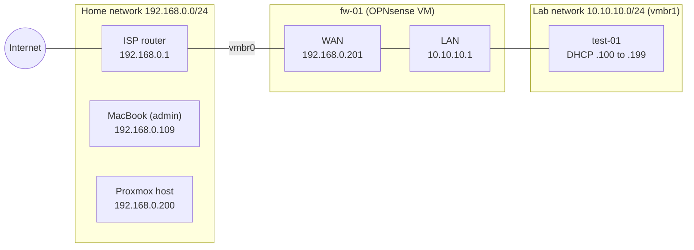

What the firewall allows:

| Traffic | Result | What decides it |
| --- | --- | --- |
| Mac → lab | Allowed | WAN rule `Allow admin Mac to lab`, only from the Mac's IP |
| Lab → internet | Allowed | OPNsense's default LAN rule, plus NAT |
| Lab → home network (router, Proxmox, Mac) | Blocked and logged | LAN rule `Block lab to home network`, above the default rule |
| Anything else from the home network → lab | Blocked | No WAN rule matches, so the default block applies |

## What I did

### 1. A bridge for the lab

In Proxmox: node `pve` → System → Network → Create → Linux Bridge.

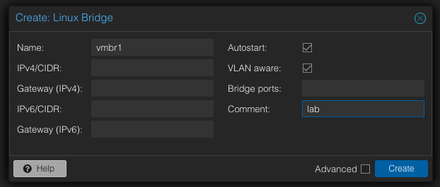

- **No bridge ports:** without a physical network card, the bridge only exists inside Proxmox, and its only way out is `fw-01`.
- **No IP:** if the host had an address on the lab network, that would be a path between the lab and the house that skips the firewall.
- **VLAN aware:** not used yet. Phase 4 splits the lab into VLANs on this same bridge.

> [!NOTE]
> Network changes in Proxmox stay pending until you click **Apply Configuration**. Until then, `vmbr1` doesn't show up in the VM wizard.

### 2. The firewall VM

**The image.** Proxmox can download an ISO and decompress it in one step, so the ~500 MB image never goes through my Mac. In `local (pve)` → ISO Images → **Download from URL**, I pasted the link from an OPNsense mirror and chose `bz2` under Decompression algorithm:

```text
https://pkg.opnsense.org/releases/26.7/OPNsense-26.7-dvd-amd64.iso.bz2
```

**A fixed IP for the Mac.** The firewall rule that lets me in uses my Mac's IP, so that IP can't change. I reserved `192.168.0.109` for the Mac on the home router.

> [!TIP]
> On macOS, set **Private Wi-Fi address** to **Fixed** for your home network (System Settings → Wi-Fi → Details). With Rotating, the Mac changes its MAC address from time to time, and the router's reservation stops matching.

**The VM.** Create VM. These are the values I ended up with: `net0` was first created as Intel E1000 ([problem 1](#problem-1-one-network-card-showed-up-as-em0)), and the RAM started at 2 GB (see below).

| Setting | Value | Why |
| --- | --- | --- |
| VM ID / name | `100` / `fw-01` | The name says what it does, like `web-01` |
| Guest OS type | Other | OPNsense is based on FreeBSD, which isn't Linux or Windows |
| Disk | 20 GB on `local-lvm` | A thin pool only uses what the VM writes |
| CPU / RAM | 2 cores / 4 GB for the install, then 2 GB | The installer needs more RAM than OPNsense does |
| `net0` | `vmbr0`, VirtIO, Proxmox firewall off, **Disconnect** checked | The WAN, on the home side |
| `net1` (added after creating the VM) | `vmbr1`, VirtIO, Proxmox firewall off | The LAN, on the lab side |
| Start at boot | Yes, order `1` | Without `fw-01` the lab has no network, so it starts first |

**Why Disconnect.** Out of the box, OPNsense runs a DHCP server on whatever card it treats as the LAN. If it picked the card on my home network, it would hand out wrong addresses to every device in the house: a *rogue DHCP server*, a classic network incident. With the virtual cable unplugged during the install, that can't happen. I plugged it back in once the WAN had its static IP.

**Why the Proxmox firewall is off on both cards.** OPNsense is the firewall here. A second layer of filtering in front of it would only make problems harder to diagnose.

**Why 4 GB for the install.** I started with 2 GB, and the installer warned me:

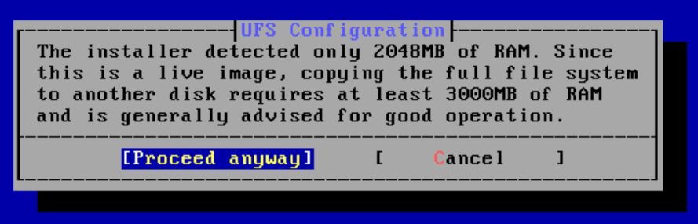

The DVD image boots a live system, and copying it to the disk needs at least 3000 MB of RAM, as the warning says. "Proceed anyway" might have worked, but if it ran out of memory halfway, I'd have had a broken install. I shut the VM down, gave it 4 GB, and went back to 2 GB after the install. RAM changes apply on the next boot, so the VM has to be shut down: rebooting from inside isn't enough.

### 3. Installing OPNsense and the console

I logged in at the console as `installer` (password `opnsense`) and installed on UFS. The OPNsense docs recommend ZFS because it handles power cuts better, but ZFS uses more RAM. With 2 GB and Proxmox snapshots to roll back, UFS is enough (the same reasoning as ext4 for Proxmox in phase 1).

> [!WARNING]
> Remove the ISO only after the installer reboots. I removed it before rebooting and the console filled with this, because the live system was still running from the ISO:
>
> 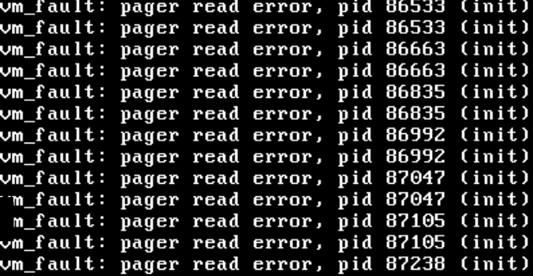
>
> The install had already finished, so I stopped the VM, started it again, and it booted from the disk.

**Which card is which.** OPNsense doesn't know which card goes to the house. In Proxmox, `fw-01` → Hardware shows each card's MAC address, and the console's option 1 (Assign interfaces) lists the cards with their MACs. The MAC is the only reliable way to match them:

| Proxmox | MAC ends in | OPNsense name | Role |
| --- | --- | --- | --- |
| `net0` (`vmbr0`) | `:ba` | `vtnet0` | WAN |
| `net1` (`vmbr1`) | `:ed` | `vtnet1` | LAN |

`vtnet` is FreeBSD's name for VirtIO cards. The first time, one of them showed up as `em0` instead ([problem 1](#problem-1-one-network-card-showed-up-as-em0)).

**IP addresses.** With option 2 (Set interface IP address):

- **WAN:** static `192.168.0.201/24`, gateway `192.168.0.1`. I answered *no* to using the gateway as DNS server, because my router doesn't answer DNS queries ([writeup 01, problem 2](01-proxmox-dual-boot.md#problem-2-router-reachable-but-names-didnt-resolve)). No IPv6: the lab is IPv4 only, for now.
- **LAN:** `10.10.10.1/24`, with **no** gateway. The gateway only goes on the interface that leads to the internet; with one on the LAN, OPNsense would treat it as a second WAN. DHCP on, from `10.10.10.100` to `10.10.10.199`. Addresses `.2` to `.99` stay free for servers with static IPs in the next phases.

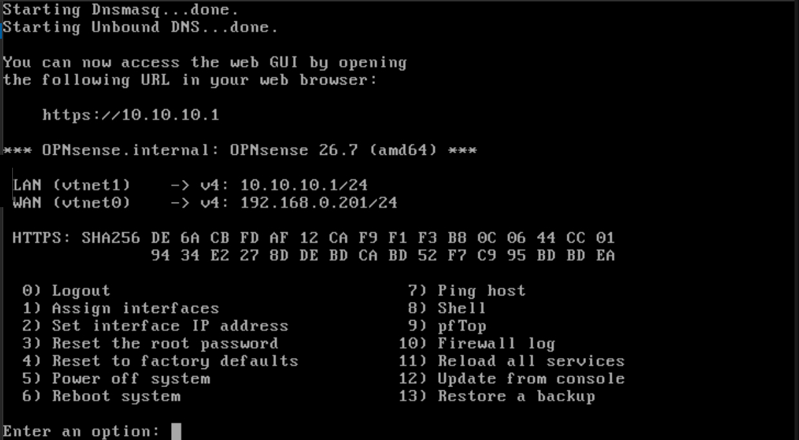

Then I reconnected the WAN (unchecked Disconnect on `net0`) and used option 7 (Ping host) to ping `192.168.0.1` and `1.1.1.1`. Both answered: `fw-01` could reach the house and the internet. Before going on, I took a snapshot of the VM called `clean-install`.

### 4. Reaching the web interface from the Mac

**Turning filtering off.** On the WAN, the firewall blocks everything coming in, including its own web interface, and my Mac is on the WAN side. In the console, option 8 (Shell):

```sh
pfctl -d    # disable packet filtering until the next reload or reboot
```

**The setup wizard.** At `https://192.168.0.201`, the choices that matter:

| Field | Value | Why |
| --- | --- | --- |
| Hostname / Domain | `fw-01` / `lab.home.arpa` | `home.arpa` is reserved for home networks; a subdomain keeps lab names separate |
| DNS servers / Override DNS | Empty / unchecked | Unbound resolves names itself. Never `192.168.0.1` |
| Enable Resolver | Checked | Unbound is the lab's DNS server |
| Enable DNSSEC | Unchecked, for now | It validates DNS answers, but while setting up it's one more thing that can fail |
| Block RFC1918 private networks (WAN) | **Unchecked** | `fw-01`'s "internet" is my home network, which uses private addresses. Checked, it blocks my Mac |
| Block bogon networks (WAN) | Unchecked | Optional here. The WAN doesn't face the internet: unsolicited traffic from the internet stops at the home router's NAT, so the filter would have almost nothing to do |
| Optimize for Multiwan | **Unchecked** | For firewalls with two or more internet links. Unchecked, it turns off *reply-to* for the whole firewall (see below) |
| Automatic DHCP/DNS registration | Checked | Lab machines that get an IP by DHCP can be found by name, like `test-01.lab.home.arpa` |

**Reply-to.** By default, OPNsense sends the replies to traffic that came in through the WAN back through the WAN's gateway, the home router. That helps when a firewall has two internet links. Here, my Mac is on the same network as the WAN, so the replies have to go straight to the Mac. Through the router, connections half work. With Multiwan unchecked, the wizard turns reply-to off globally. The saved configuration confirms it:

```xml
<!-- config.xml, inside <system> -->
<disablereplyto>1</disablereplyto>
```

Applying the wizard reloads the firewall, and a reload turns filtering back on. With no rule for the Mac yet, the web interface stops answering until `pfctl -d` again ([problem 3a](#3a-every-apply-turned-filtering-back-on)).

**A route from the Mac to the lab.** Since I only turn the lab on when I use it, I added two aliases to `~/.zshrc` instead of a permanent route:

```bash
cat >> ~/.zshrc <<'EOF'
alias labup='sudo route -n add -net 10.10.10.0/24 192.168.0.201'
alias labdown='sudo route -n delete -net 10.10.10.0/24'
EOF
source ~/.zshrc
```

```text
$ labup
Password:
add net 10.10.10.0: gateway 192.168.0.201
$ route -n get 10.10.10.1
   route to: 10.10.10.1
destination: 10.10.10.0
       mask: 255.255.255.0
    gateway: 192.168.0.201
  interface: en0
      flags: <UP,GATEWAY,DONE,STATIC,PRCLONING>
```

From here on, I opened the web interface at `https://10.10.10.1`, the firewall's LAN address. That's the address the WAN rule allows.

The wizard can replace the DHCP range set in the console, so I checked it in Services → Dnsmasq DNS & DHCP and made sure it went from `.100` to `.199`.

### 5. Aliases and rules

**Aliases** are named lists of addresses. Rules use the name, so if my Mac's IP changes, I change it in one place. OPNsense doesn't allow hyphens in alias names, so they're in `SNAKE_CASE`. In Firewall → Aliases:

| Name | Type | Content | Description |
| --- | --- | --- | --- |
| `HOME_NET` | Network(s) | `192.168.0.0/24` | Home network |
| `ADMIN_MAC` | Host(s) | `192.168.0.109` | Admin Mac |

I first created `ADMIN_MAC` as Network(s) and changed it to Host(s) later. For a single address, both work.

**The WAN rule** lets the Mac into the lab. In Firewall → Rules, interface WAN:

| Field | Value |
| --- | --- |
| Action / Direction | Pass / in |
| Version / Protocol | IPv4 / any |
| Source | `ADMIN_MAC` |
| Destination | LAN net |
| Disable reply-to (advanced mode) | Checked |
| Description | `Allow admin Mac to lab` |

LAN net includes `10.10.10.1`, so this one rule covers the web interface and every machine in the lab. Reply-to is already off for the whole firewall, but checking it here too records the intent where it matters, and keeps the rule working if that global setting ever changes.

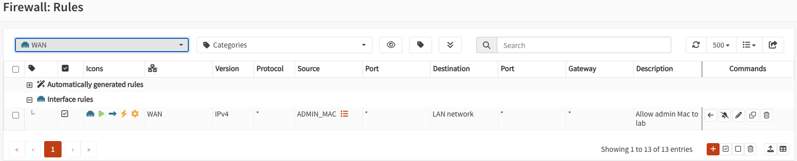

**The LAN rule** keeps the lab away from the house:

| Field | Value |
| --- | --- |
| Action / Direction | Block / in |
| Version / Protocol | IPv4 / any |
| Source | LAN net |
| Destination | `HOME_NET` |
| Log | Checked |
| Description | `Block lab to home network` |
| Sequence | `10` |

Rules are checked from the top and the first match wins. OPNsense's default LAN rules allow everything, so the block has to come before them, or it never applies. The defaults came with Sequence `1` (IPv4) and `11` (IPv6), so there was no lower number free. I renumbered them to `20` and `21`, and gave the block `10`. Gaps of 10 leave room for future rules without renumbering everything.

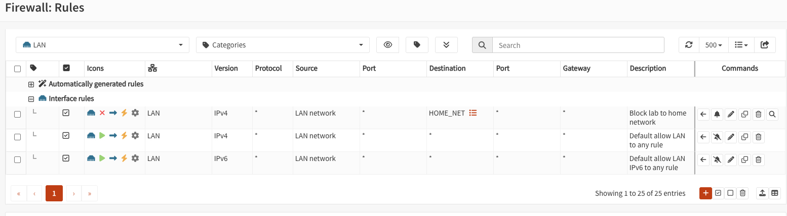

**Block** drops the traffic silently (*Reject* would answer back). **Log** records every drop, which is how I proved the rule works in [step 7](#7-testing-with-a-throwaway-container).

Then I rebooted OPNsense. The web interface opened without `pfctl -d`: the configuration was saved, and the firewall starts with my rules.

### 6. Updates, guest agent and backups

- **Update:** System → Firmware → Status → Check for updates, then Update. From 26.7 to 26.7.5. It also tested `fw-01`'s own DNS: to find the update servers, Unbound has to resolve names.
- **QEMU guest agent:** the `os-qemu-guest-agent` plugin is a community plugin, hidden by default in System → Firmware → Plugins until you check the box to show them. In Proxmox, `fw-01` → Options → QEMU Guest Agent → Enabled, then a full shutdown and start (a reboot isn't enough). Now Proxmox can shut `fw-01` down cleanly and shows its IPs in the Summary.
- **Backups:** System → Configuration → Backups → Download configuration, saved outside the repository. Snapshots in Proxmox: `clean-install` (after the console setup), `pre-update` (before updating) and `base-config` (the finished configuration).

> [!CAUTION]
> Never commit OPNsense's `config.xml`, or the diffs in System → Configuration → History. They include the root password hash and the web interface certificate's private key. If you want to show part of the configuration, copy only the snippet that explains something.

### 7. Testing with a throwaway container

To test from inside the lab, I created an LXC container from the `debian-13-standard` template. A container uses the Proxmox host's kernel (its login banner shows `7.0.14-19-pve`, the same as the host), so it boots in seconds and uses little RAM. A VM brings its own kernel and is more isolated. For network tests, a container is enough.

| Setting | Value | Why |
| --- | --- | --- |
| CT ID / hostname | `900` / `test-01` | A high ID makes it obvious it's disposable |
| Unprivileged | Yes | Root in the container isn't root on the host |
| Resources | 1 core, 512 MB RAM, 4 GB disk | |
| Network | `vmbr1`, IPv4 by DHCP, no IPv6, Proxmox firewall off | It has to get its address from `fw-01` |
| DNS | `lab.home.arpa` / `10.10.10.1` | With "use host settings", it would copy Proxmox's DNS (`1.1.1.1`) and skip the lab's DNS |

**Does the lab work?** From the container's console, one layer at a time:

```text
root@test-01:~# ip -br a
lo               UNKNOWN        127.0.0.1/8 ::1/128
eth0@if7         UP             10.10.10.144/24 fe80::be24:11ff:feee:c312/64
root@test-01:~# ip route
default via 10.10.10.1 dev eth0
10.10.10.0/24 dev eth0 proto kernel scope link src 10.10.10.144
root@test-01:~# cat /etc/resolv.conf
domain lab.home.arpa
search lab.home.arpa
nameserver 10.10.10.1
root@test-01:~# ping -c 3 10.10.10.1
3 packets transmitted, 3 received, 0% packet loss, time 2058ms
root@test-01:~# ping -c 3 1.1.1.1
3 packets transmitted, 3 received, 0% packet loss, time 2003ms
root@test-01:~# ping -c 3 debian.org
PING debian.org (151.101.130.132) 56(84) bytes of data.
3 packets transmitted, 3 received, 0% packet loss, time 2001ms
```

(Ping output trimmed to the summary lines.)

| Check | Result | What it proves |
| --- | --- | --- |
| `ip -br a` | `10.10.10.144/24` | `fw-01`'s DHCP works (inside `.100` to `.199`) |
| `ip route` | `default via 10.10.10.1` | The lab's way out is `fw-01` |
| `resolv.conf` | `nameserver 10.10.10.1` | The container uses the lab's DNS |
| `ping 10.10.10.1` | Answers | The lab network works |
| `ping 1.1.1.1` | Answers | Internet by IP: routing and NAT work |
| `ping debian.org` | Resolves and answers | Unbound works |

The lease showed up in Services → Dnsmasq DNS & DHCP → Leases. That's the first place to look when a lab machine doesn't get an IP:

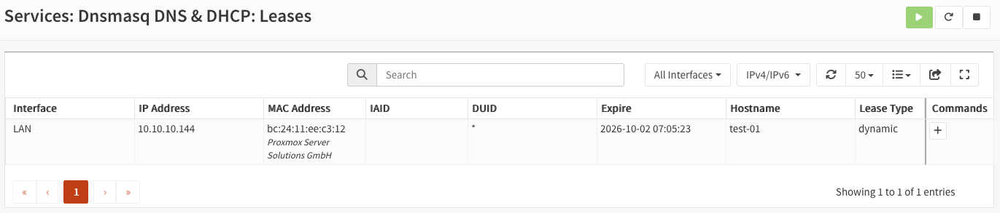

**Is the house protected?** Still from `test-01`:

```text
root@test-01:~# ping -c 3 192.168.0.1
PING 192.168.0.1 (192.168.0.1) 56(84) bytes of data.

--- 192.168.0.1 ping statistics ---
3 packets transmitted, 0 received, 100% packet loss, time 2062ms

root@test-01:~# ping -c 3 192.168.0.200
PING 192.168.0.200 (192.168.0.200) 56(84) bytes of data.

--- 192.168.0.200 ping statistics ---
3 packets transmitted, 0 received, 100% packet loss, time 2025ms
```

The pings alone don't say *why* they failed. The log does. In Firewall → Log Files → Live View, filtered by `label contains Block lab`, every ping was dropped on the LAN by my rule:

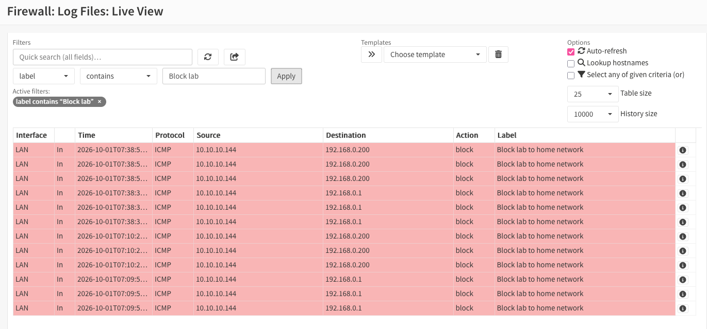

(The screenshot shows two rounds of the same test: the first one, and a repeat to take this capture.)

Something that confused me at first: the lab can't reach `192.168.0.1`, but it reaches `1.1.1.1` *through* `192.168.0.1`. A rule looks at the address a packet is going to. A packet for `1.1.1.1` carries `1.1.1.1` as its destination all the way; the router is only the next hop. Blocking the router's address stops connections *to* the router, not traffic that uses it as a gateway.

**Can the Mac get in?** From the Mac, with `labup` on:

```text
$ ping -c 3 10.10.10.144
PING 10.10.10.144 (10.10.10.144): 56 data bytes
64 bytes from 10.10.10.144: icmp_seq=0 ttl=63 time=103.244 ms
64 bytes from 10.10.10.144: icmp_seq=1 ttl=63 time=16.783 ms
64 bytes from 10.10.10.144: icmp_seq=2 ttl=63 time=10.777 ms

--- 10.10.10.144 ping statistics ---
3 packets transmitted, 3 packets received, 0.0% packet loss
```

The replies come back even though the lab can't start connections to the house: they belong to a connection the Mac started. `ttl=63` instead of 64 shows that the packets crossed one router, `fw-01`.

**Does the house depend on the lab?** I shut down `fw-01` from Proxmox and browsed from the Mac: everything loaded. Then I started it again.

Finally, I deleted `test-01` and kept the template for later.

## What went wrong and how I fixed it

### Problem 1: one network card showed up as `em0`

**Symptom.** In the console's option 1, the two cards weren't both `vtnet`. The one with `net0`'s MAC was `em0`, an Intel PRO/1000:

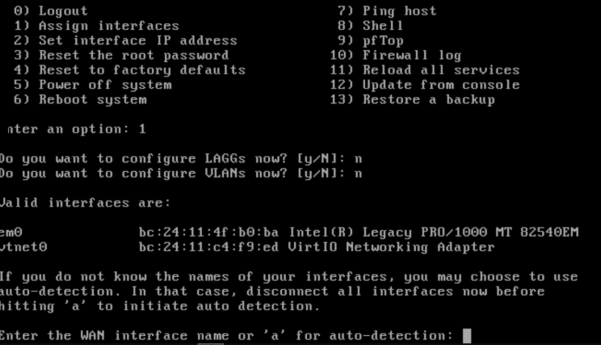

**Cause.** With Guest OS type *Other*, Proxmox suggests the Intel E1000 model for the first network card, and I didn't change it. I added `net1` later and picked VirtIO for it, so the two ended up different. E1000 imitates a physical card that's more than 20 years old, and Proxmox has to emulate it in software. VirtIO is made for virtual machines: it's faster and uses less CPU.

**Fix.** Nothing was configured yet, so I fixed it right away: shut down `fw-01`, Hardware → `net0` → Edit → Model: **VirtIO (paravirtualized)**, start it again and repeat option 1. The MAC doesn't change with the model, so I matched the cards by MAC again: `:ba` is the WAN, `:ed` the LAN. The card names can change after a change like this; the MACs don't.

**Lesson.** The defaults in Proxmox's VM wizard depend on the guest OS type. With *Other*, check the network card model.

### Problem 2: the root password worked on the console but not in the browser

**Symptom.** At `https://192.168.0.201`, `root` with the password I'd set during the install gave `Wrong username or password`. I reset it from the console without special characters, and it still failed. Only a password with all lowercase letters worked. System → Configuration → History later showed three resets within four minutes (`Root user reset from console`).

**Cause.** The Proxmox console runs in the browser (noVNC), and from my Mac it didn't pass the Shift key. Every uppercase letter I typed during the install was saved as lowercase, and symbols that need Shift came out as their unshifted key (`_` became `-`). Password fields don't show what you type, so I couldn't notice. Logging in at the console kept working because I typed the same keys and the console dropped Shift the same way every time. The browser sent the real characters, which didn't match.

**Fix.** A password with only lowercase letters, which reaches OPNsense the same way from the console and from the browser. The console is the emergency way in, so the password has to be typeable there. Without symbols or uppercase, length is what keeps it strong.

**Side effect.** The failed logins got my Mac blocked ([problem 3b](#3b-my-mac-was-in-sshlockout)).

**Lesson.** After setting a password through a remote console, try it right away through the other path you'll use.

### Problem 3: locked out of the web interface

I lost the web interface several times. Some of it was expected. The rest had a single cause that I misdiagnosed the first time. The way back was always the VM's console in Proxmox: option 8 (Shell) and `pfctl -d`. The console doesn't depend on the network, so a firewall can't lock you out of it.

#### 3a. Every Apply turned filtering back on

**Symptom.** Right after clicking Apply in Firewall → Aliases, the web interface stopped answering.

**Cause.** `pfctl -d` only lasts until the next reload, and any Apply in OPNsense reloads the firewall: the wizard, aliases, rules. Filtering came back on, and the rule that lets the Mac in didn't exist yet.

**Fix.** `pfctl -d` once more, and then create the WAN rule. Until that rule works, every Apply locks you out again.

#### 3b. My Mac was in `sshlockout`

**Symptom.** Before creating the WAN rule, I checked the aliases list. The `sshlockout` table had two addresses, one of them my Mac's, and 162 blocked packets:

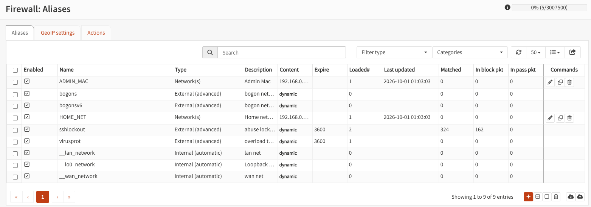

**Cause.** After several failed logins, through SSH or the web interface, OPNsense blocks the address for an hour (the 3600 in Expire). The block applies to connections to the firewall itself, its SSH and its web interface, and it comes before any rule I write. The failed logins were the ones from problem 2.

**The fix that should have worked.** In Firewall → Diagnostics → Aliases, select `sshlockout` and delete the Mac's address, or wait an hour.

**What I actually did.** I went to that page and deleted my Mac's address, but from the wrong table (3c). Since my delete never reached `sshlockout`, the entry most likely expired on its own about an hour after the failed logins.

#### 3c. The rule was right, but the alias was empty

**Symptom.** When I applied the WAN rule, the open tab hung. At the time, I blamed the stateful firewall: the tab's connection had been opened with filtering off, so `pf` had no state for it. A new connection seemed to confirm it: `curl` and a private window both worked.

```text
$ curl -k -I https://10.10.10.1
HTTP/2 403
content-type: text/html; charset=UTF-8
server: OPNsense
```

(Headers trimmed. The `403` doesn't matter: `curl` sent a request without logging in. What matters is that the web server answered.)

Then I applied the LAN rule and lost the web interface again. This time a new connection didn't help either:

```text
$ curl -k -I https://10.10.10.1
curl: (28) Failed to connect to 10.10.10.1 port 443 after 75001 ms: Couldn't connect to server
```

**Evidence.** The firewall log in the console (option 10) showed my Mac's packets being dropped on the WAN (`vtnet0`). Transcribed from the console and trimmed:

```text
rule 4/0(match): block in on vtnet0: (tos 0x0, ttl 64, id 0, offset 0, flags [DF], proto TCP (6), length 64)
    192.168.0.109.65008 > 10.10.10.1.443: Flags [S], cksum 0x83fb (correct), seq 831592551, win 65535, ...
rule 4/0(match): block in on vtnet0: (tos 0x0, ttl 64, id 52501, offset 0, flags [none], proto TCP (6), length 40)
    192.168.0.109.64838 > 10.10.10.1.443: Flags [.], cksum 0x9d90 (correct), ack 400641240, win 2387, length 0
```

- The first packet is a `SYN` (`Flags [S]`), the start of a new connection, so it was checked against the rules. It was dropped by `rule 4`, which isn't mine: my WAN rule didn't match, and the packet fell through to OPNsense's default block.
- The second is an `ACK` (`Flags [.]`) from a connection opened while filtering was off. That's the stateful drop I had blamed, and it does happen. But it only kills old connections, and here new ones were failing too.

So the rule existed, but it didn't match my Mac. Firewall → Diagnostics → Aliases shows the address tables the firewall is actually using, and `ADMIN_MAC` was empty:

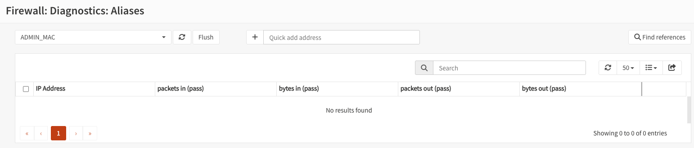

The Content field in Firewall → Aliases was empty too.

**Cause.** System → Configuration → History keeps a copy of the configuration for every change, with who made it and through which page. It showed `alias_util/delete/ADMIN_MAC` three times:

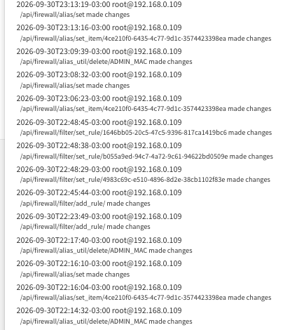

Comparing each one with the version before it shows the same change, the Mac's address disappearing from the alias:

```diff
# 22:16:10 (alias/set) → 22:17:40 (alias_util/delete/ADMIN_MAC), trimmed
-            <content>192.168.0.109</content>
+            <content/>
```

`alias_util/delete` is the trash icon in Firewall → Diagnostics → Aliases. I went to that page to clean `sshlockout` (3b), and the first delete is from that moment: the dropdown was on `ADMIN_MAC`, and I deleted my Mac's address from the wrong table. For aliases of type Host(s) or Network(s), that button doesn't only remove the address from the table in use: it also removes it from the alias's saved content ([OPNsense's code](https://github.com/opnsense/core/blob/master/src/opnsense/mvc/app/controllers/OPNsense/Firewall/Api/AliasUtilController.php), `deleteAction`). An empty alias doesn't cause any error. The rule that uses it just stops matching.

I don't remember the second and third deletes; the history is the only record of them. Twice I put the IP back, and twice it was deleted again from the same page without my noticing.

Putting the timeline together (times from the history and from `curl`'s `date` header):

| Time | What I did | `ADMIN_MAC` |
| --- | --- | --- |
| 22:02 | Created the alias | `192.168.0.109` |
| 22:03 | Applied the aliases: locked out (3a), `pfctl -d` | `192.168.0.109` |
| 22:14 | Trash icon in Diagnostics → Aliases, thinking I was cleaning `sshlockout` | empty |
| 22:16 | Edited the alias and put the IP back | `192.168.0.109` |
| 22:17 | Trash icon again | empty |
| 22:23 | Created the WAN rule and applied it: locked out | empty |
| 22:37 | `curl` and a private window worked | empty |
| 22:45 to 22:48 | Created the LAN rule, renumbered the default rules and applied: locked out | empty |
| 23:06 | Put the IP back | `192.168.0.109` |
| 23:09 | Trash icon a third time | empty |
| 23:13 | Put the IP back, applied, `pfctl -e` | `192.168.0.109` |
| 23:17 | `curl` got `HTTP/2 403` | `192.168.0.109` |

The alias was already empty when I applied the WAN rule, so that lockout had the same cause as the one after the LAN rule. And at 22:37, with an empty alias and filtering on, nothing from the Mac could have connected. So filtering was most likely off when I ran that test. I don't remember whether I ran `pfctl -d` right before it, but I can't find anything else that explains it. If filtering was off, my "new connection" test couldn't have failed, so it proved nothing.

**Fix.** I typed `192.168.0.109` back into Content and clicked Apply, which also turns filtering back on (I ran `pfctl -e` too, to be sure). The table had the address again, and `curl` got its `HTTP/2 403`:

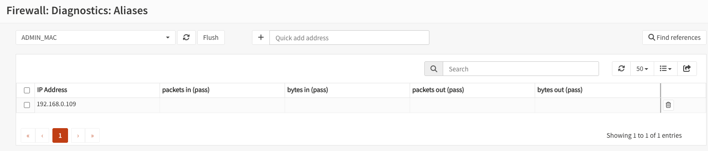

**Lessons.**

- When a rule that looks right doesn't work, check what the firewall loaded, not what the rule says: Diagnostics → Aliases for the tables, and the log for which rule dropped the packet.
- A diagnostics page isn't always read-only. Before deleting anything, check which table is selected and what the button changes.
- A test that seems to confirm an explanation only counts if it could have failed. Mine most likely ran with filtering off.
- When you don't know what changed, OPNsense's configuration history knows: who, when, through which page, and the exact diff.

### Smaller issues

| What happened | Cause | Fix |
| --- | --- | --- |
| The installer warned it had 2048 MB of RAM and needed 3000 MB | Copying the live image to the disk needs at least 3000 MB of RAM | 4 GB for the install, back to 2 GB after ([step 2](#2-the-firewall-vm)) |
| The console filled with `vm_fault: pager read error` | I removed the ISO before the installer rebooted | The install had finished: stop and start, and it booted from the disk ([step 3](#3-installing-opnsense-and-the-console)) |
| The timezone was still UTC, so the logs were 3 hours ahead | I picked `America/Argentina/Buenos_Aires` in the wizard, but the saved configuration still had `Etc/UTC` | System → Settings → General → Timezone |
| Proxmox's Create CT wizard wouldn't go past the first tab | The password field was red: container passwords need at least 5 characters | A longer password. The wizard's tabs only advance with Next once every field is valid |

## What I learned

- A Proxmox bridge with no network card and no host IP is an isolated network. If the firewall VM is the only machine connected to both sides, every packet has to go through it.
- A stateful firewall only checks the rules when a connection starts. Replies ride on the saved state. That's why the Mac can work inside the lab while the lab can't start anything toward the house, and why connections opened with filtering off die when it comes back on.
- Rules are checked from the top and the first match wins. A block below an "allow everything" rule never applies.
- A rule looks at a packet's final destination, not at the next hop. Blocking the router's address doesn't stop the lab from using the router to reach the internet.
- NAT means the home router never needs to know the lab exists. Going in the other direction needs a route.
- On OPNsense, reply-to sends replies through the WAN gateway. If your admin machine is on the same network as the WAN, turn it off, or connections half work.
- When a correct-looking rule doesn't work, check what the firewall actually loaded (Diagnostics → Aliases) and which rule dropped the packet (the log).
- A test that seems to confirm an explanation only counts if it could have failed. My "a new connection works" test most likely ran with filtering off, so it seemed to confirm the wrong cause.
- OPNsense keeps every configuration change in System → Configuration → History, with who made it, when, and through which page. When something changed and you don't know how, diff two versions.
- Any Apply in OPNsense reloads the firewall and turns `pfctl -d` off. The console is the emergency exit, so its password has to be typeable there.
- Unplug a new firewall's home-side network card until you know which card it uses as LAN, or its DHCP server can hand out addresses to the whole house.

## If you hit the same problem

### You're locked out of the OPNsense web interface

From the VM's console in Proxmox, option 8 (Shell):

```sh
pfctl -d    # filtering off until the next reload or reboot
```

With the web interface back, find the cause before turning filtering on again:

1. **Is your IP blocked for failed logins?** Firewall → Diagnostics → Aliases, select `sshlockout` and delete your address. Check the dropdown first.
2. **Does your rule's alias have your IP?** Same page, select your alias. If it's empty, fix the Content in Firewall → Aliases. If it emptied by itself, look in System → Configuration → History for `alias_util/delete`: that's the trash icon on this page, and on Host(s) and Network(s) aliases it changes the saved alias too.
3. **Apply, and test with a new connection,** not the tab you had open. Apply turns filtering back on (or run `pfctl -e` if there's nothing to apply), and the test only means something with filtering on:

   ```bash
   curl -k -I https://<firewall-ip>    # any HTTP/ answer means you got through
   ```

4. **Still locked out? Find the rule that drops you.** Console option 10 (Firewall log): a `Flags [S]` from your IP with a rule number that isn't yours means your pass rule doesn't match. `pfctl -d` again, and recheck the rule and its alias.

### The OPNsense password works on the Proxmox console but not in the browser

The browser console (noVNC) may not be sending Shift, Caps Lock or your keyboard layout correctly, so the saved password differs from the one you think you typed. From the console, option 3 (Reset the root password), set a long password with only lowercase letters and numbers.

### OPNsense lists `em0` instead of `vtnet`

That card's model is Intel E1000. Shut down the VM, change the card's Model to VirtIO in Hardware (the MAC stays the same), start it, and assign the interfaces again by MAC.

### The console fills with `vm_fault: pager read error` right after installing

The ISO was removed while the installer was still running from it. Stop and start the VM. If it boots from the disk, you're done. If not, put the ISO back and install again.

### The Mac can't open `https://10.10.10.1`

```bash
route -n get 10.10.10.1    # must say gateway: 192.168.0.201; if not, run labup
ipconfig getifaddr en0     # must be the IP in ADMIN_MAC
```

Also check that Block private networks is unchecked in Interfaces → WAN.

## Next

- Phase 3: Linux servers (Ubuntu and Rocky) on the lab network, SSH, and VM backup and restore.
- Turn on DNSSEC validation in Unbound now that everything else works.
